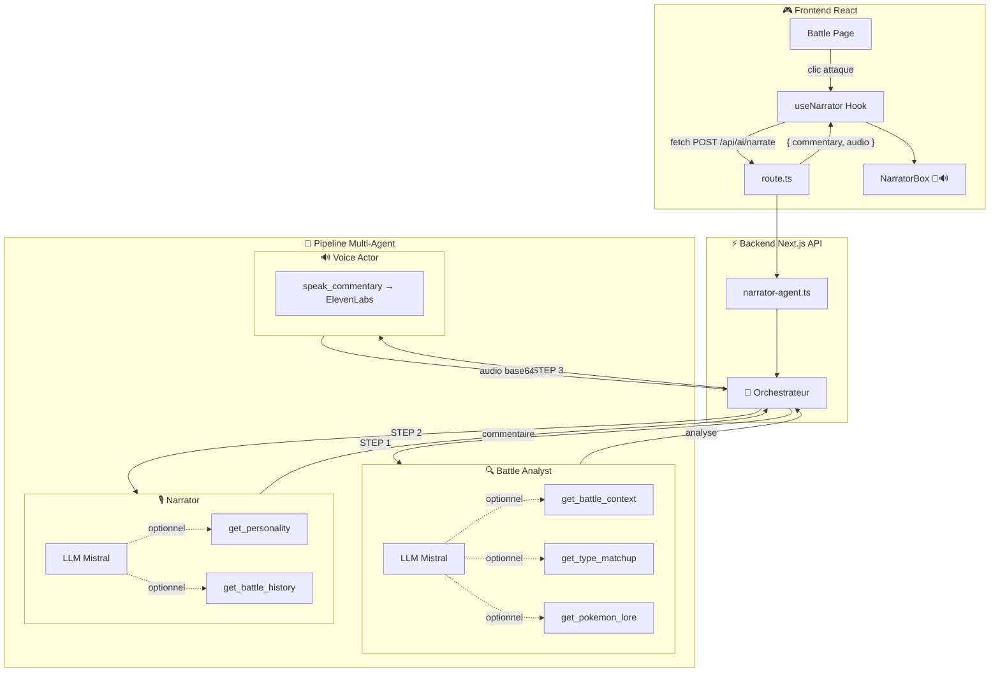
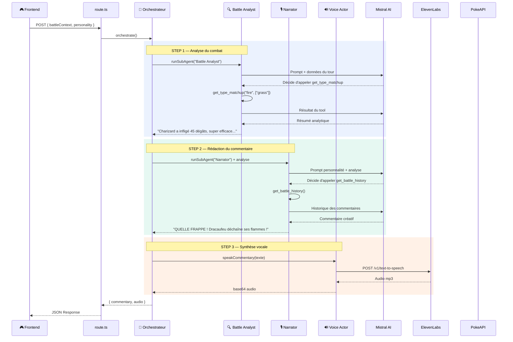
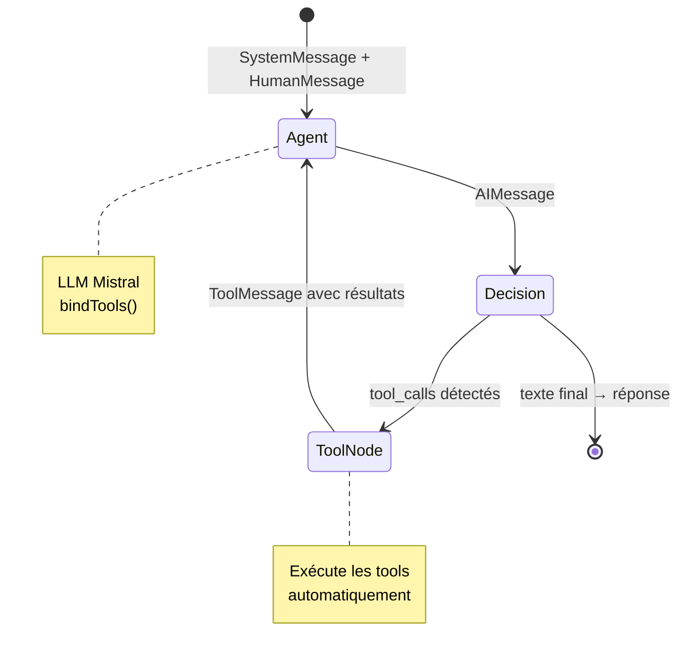

# 🎮 Pokémon Pack & Battle

Un jeu web Pokémon original combinant l'ouverture de packs, la collection, les combats stratégiques au tour par tour, et un **agent IA narrateur multi-agent** qui commente les combats en temps réel avec synthèse vocale.


---

## ✨ Fonctionnalités

### 📦 Système de Packs
- Plusieurs types de packs avec différentes raretés (Common, Rare, Super Rare, Epic, Legendary)
- Animation d'ouverture immersive avec effets visuels
- Système de monnaie intégré pour l'achat de packs

### 📖 Pokédex & Collection
- Vue complète des 151 Pokémon de la 1ère génération
- Filtrage par rareté et tri (numéro, rareté, niveau)
- Mode "Show Missing" pour voir les Pokémon non collectés
- Fiche détaillée de chaque Pokémon avec stats et attaques

### ⚔️ Combats au Tour par Tour
- Sélection d'équipe (jusqu'à 3 Pokémon)
- Système de combat avec types, coups critiques et efficacité
- Ennemis générés dynamiquement adaptés à votre niveau
- Arena de combat animée avec barres de vie et log de combat
- Récompenses en monnaie après chaque victoire

### 📈 Système de Progression
- **Leveling par duplication** : les doublons augmentent le niveau de vos Pokémon (formule log₂)
- Les stats évoluent avec le niveau
- Économie de jeu équilibrée entre packs et combats

### 🧠 Agent IA Narrateur Multi-Agent
- **Architecture multi-agent** avec orchestrateur + 3 sous-agents spécialisés
- **Commentaires dynamiques** générés par Mistral AI en temps réel
- **Synthèse vocale** réaliste via ElevenLabs (voix française narrative)
- **6 outils IA** (tools) : analyse de combat, types, Pokédex, personnalité, historique, TTS
- **3 personnalités** de narrateur interchangeables (Commentateur Sportif, Rival, Professeur)

---

## 🤖 Architecture IA Multi-Agent

Le narrateur de combat est un système multi-agent construit avec **LangChain.js** et **LangGraph**. Un orchestrateur déterministe délègue à 3 sous-agents, chacun étant un **StateGraph LangGraph** compilé avec son propre LLM et ses outils.

### Vue d'ensemble



### Flow d'exécution détaillé



### Boucle Agent-Tools (LangGraph StateGraph)

Chaque sous-agent (Analyst, Narrator) est un graph LangGraph avec une **boucle agent ↔ tools** :



### Les 6 outils (tools)

| Outil | Sous-Agent | Input (Zod) | Source | Description |
|-------|-----------|-------------|--------|-------------|
| `get_battle_context` | 🔍 Analyst | `{}` | État du combat | Données complètes du tour (attaquant, défenseur, dégâts, KO) |
| `get_type_matchup` | 🔍 Analyst | `{ attackType, defenderTypes }` | Table des types | Efficacité des types (super efficace, normal, pas efficace) |
| `get_pokemon_lore` | 🔍 Analyst | `{ pokemonName }` | **PokeAPI** live | Entrée Pokédex en français (description, genus) |
| `get_personality` | 🎙️ Narrator | `{}` | Config interne | Personnalité du narrateur (ton, catchphrases aléatoires) |
| `get_battle_history` | 🎙️ Narrator | `{}` | Mémoire in-memory | 3 derniers commentaires (anti-répétition) |
| `speak_commentary` | 🔊 Voice | `{ text }` | **ElevenLabs** | Conversion texte → audio mp3 (voix Josh, français) |

---

## 🛠️ Stack Technique

| Technologie | Rôle |
|---|---|
| **Next.js 16** | Framework React avec App Router |
| **React 19** | UI réactive et composants |
| **TailwindCSS 4** | Styling utilitaire |
| **Zustand** | State management (persisté en localStorage) |
| **Framer Motion** | Animations fluides (combats, ouverture de packs) |
| **LangChain.js** | Framework agent IA (tools, messages, models) |
| **LangGraph** | StateGraph pour les sous-agents (boucle agent ↔ tools) |
| **Mistral AI** | LLM pour génération de texte (via API OpenAI-compatible) |
| **ElevenLabs** | Synthèse vocale réaliste (TTS, voix Josh multilingual v2) |
| **PokéAPI** | Données Pokémon (sprites, stats, attaques, types) |
| **TypeScript** | Typage statique |
| **Zod** | Validation des schémas de tools |

---

## 📁 Structure du Projet

```
pokemon/
├── src/
│   ├── app/
│   │   ├── page.tsx                    # Pokédex / Collection
│   │   ├── shop/page.tsx               # Boutique de packs
│   │   ├── battle/page.tsx             # Arène de combat
│   │   ├── api/ai/narrate/route.ts     # 🧠 API endpoint narration
│   │   ├── layout.tsx                  # Layout principal
│   │   └── globals.css                 # Styles globaux
│   ├── components/
│   │   ├── game/
│   │   │   ├── PokemonCard.tsx         # Carte Pokémon
│   │   │   ├── PokemonDetailModal.tsx  # Modal détail Pokémon
│   │   │   ├── NarratorBox.tsx         # 🎙️ Box commentaire + audio
│   │   │   └── PackCard.tsx            # Carte de pack
│   │   └── layout/                     # Navbar
│   ├── hooks/
│   │   └── useNarrator.ts             # 🧠 Hook narration (fetch + audio)
│   ├── lib/
│   │   ├── ai/
│   │   │   ├── orchestrator.ts         # 🧠 Orchestrateur déterministe
│   │   │   ├── narrator-agent.ts       # Point d'entrée agent
│   │   │   ├── narrator-tools.ts       # 6 outils (3 groupes)
│   │   │   ├── narrator-tts.ts         # ElevenLabs TTS
│   │   │   ├── narrator-types.ts       # Types + personnalités
│   │   │   └── model-factory.ts        # Factory LLM multi-provider
│   │   ├── store.ts                    # State Zustand
│   │   ├── pokeapi.ts                  # Client PokéAPI
│   │   ├── battle.ts                   # Calculs de combat
│   │   └── packs.ts                    # Logique de packs
│   └── types/
│       └── index.ts                    # Types TypeScript
├── .env.local                          # Clés API (Mistral, ElevenLabs)
├── package.json
└── next.config.ts
```

---

## 🚀 Installation & Lancement

### Prérequis
- [Node.js](https://nodejs.org/) (v18+)
- npm ou yarn

### Installation

```bash
# Cloner le repo
git clone https://github.com/<ton-username>/pokemon.git
cd pokemon

# Installer les dépendances
npm install

# Configurer les clés API
cp .env.example .env.local
# Éditer .env.local avec tes clés :
# - MISTRAL_API_KEY=ta-clé-mistral
# - ELEVENLABS_API_KEY=ta-clé-elevenlabs (optionnel, pour la voix)

# Lancer en mode développement
npm run dev
```

L'application sera accessible sur [http://localhost:3000](http://localhost:3000).

### Build de production

```bash
npm run build
npm start
```

---

## 🎮 Comment Jouer

1. **Ouvre des packs** dans la boutique pour obtenir tes premiers Pokémon
2. **Consulte ta collection** dans le Pokédex et découvre les stats de chaque Pokémon
3. **Lance des combats** en sélectionnant jusqu'à 3 Pokémon de ton équipe
4. **Gagne de l'argent** en remportant des combats pour acheter plus de packs
5. **Collectionne des doublons** pour faire monter le niveau de tes Pokémon !
6. **Écoute le narrateur IA** commenter tes combats en temps réel 🎙️

---

## 📝 Licence

Ce projet est un fan-game à but éducatif. Pokémon est une marque déposée de Nintendo / Game Freak / The Pokémon Company. Toutes les données proviennent de la [PokéAPI](https://pokeapi.co/).

---

Développé avec ❤️, Next.js, LangChain et Mistral AI
